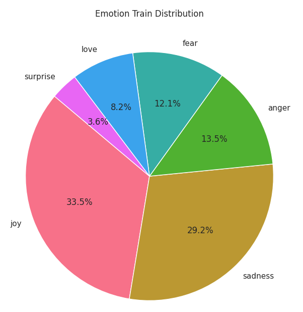
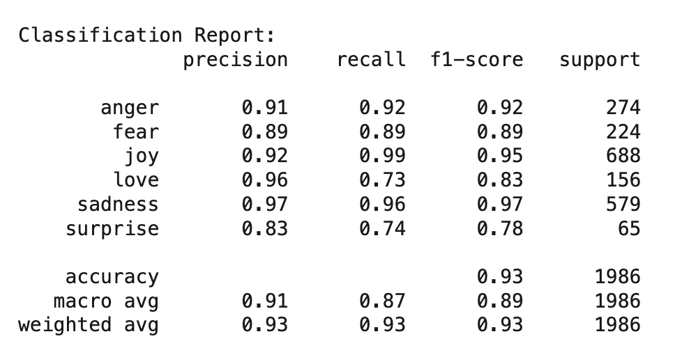
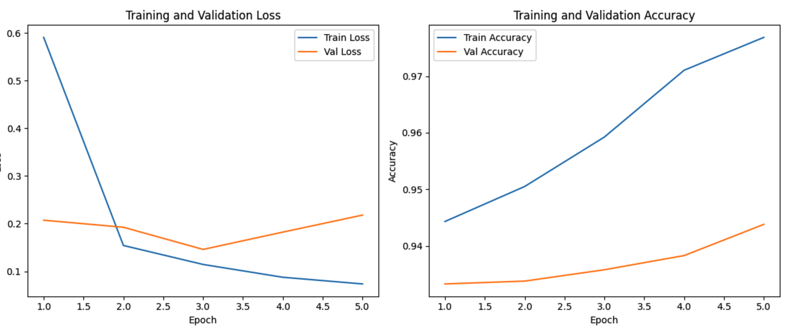
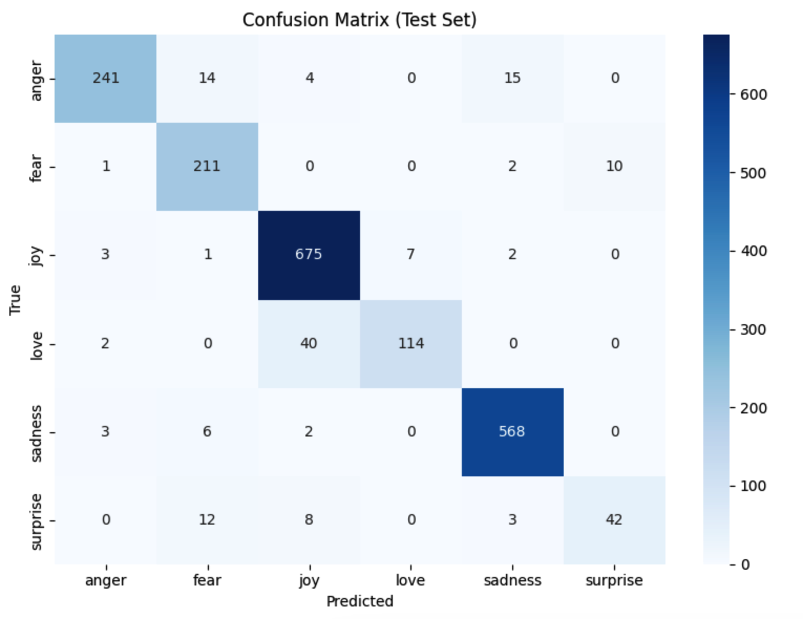
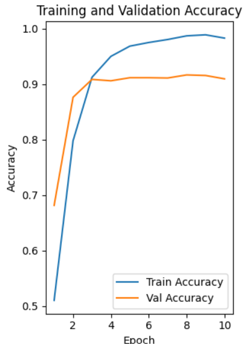
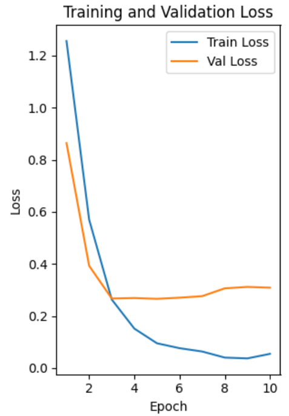
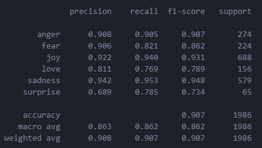
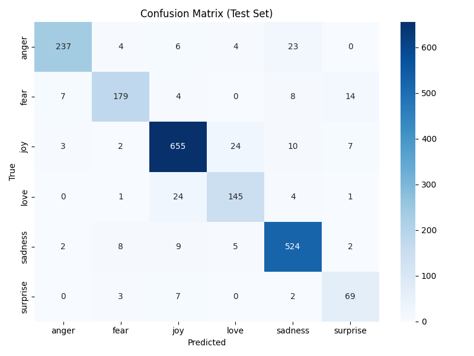

# Emotion Detection using BERT and BiLSTM

This repository contains an end-to-end project on **emotion detection** using two deep learning approaches:

- **BERT (Bidirectional Encoder Representations from Transformers)**
- **BiLSTM (Bidirectional Long Short-Term Memory)**

The project covers dataset preprocessing, model architectures, training workflows, evaluation metrics, and performance comparison.

---

## 📊 Dataset Overview

### Sample Data & Label Distribution  
- Dataset contains text sentences classified into 6 emotion categories.  
- Label distribution is **imbalanced**, especially for joy and sadness.  
- Imbalance impacts training and evaluation.

  
  

---

## 🧹 Data Preprocessing

### 1. **Text Cleaning**
- Removed URLs, mentions, repeated spaces, and unwanted characters.

### 2. **Duplicate Sentence-Label Removal**
- Removed cases where the same sentence had conflicting labels (e.g., *joy* and *love*).

### 3. **Data Leakage Prevention**
Ensured no sentence appears in more than one of `train`, `validation`, or `test`.

**Duplicates Found:**
- Train ↔ Test: 11  
- Validation ↔ Test: 3  
- Total removed: 14 test samples  

**Final Dataset Sizes:**
- Validation: `1998 → 1993`  
- Test: `2000 → 1986`

---

## 🧠 BERT Architecture

BERT is a **transformer encoder–based model** with:

- 12 encoder layers (BERT-Base)
- 12 self-attention heads per layer  
- Layer normalization + residual connections  
- WordPiece tokenization  
- Positional + segment embeddings  
- Classification through the `[CLS]` token  
- Linear classifier on top for emotion prediction  

---

## 📈 BERT Training Results

  
   
  

---

## 🔁 BiLSTM Architecture

- **Input:** Tokenized/padded sequences (length = 256)
- **Embedding Layer:**  
  - 300-dimensional pretrained Word2Vec  
  - Trainable during training
- **BiLSTM Layer:**  
  - Hidden size: 128 per direction  
  - Outputs forward + backward final hidden states  
- **Fully Connected Layer:**  
  - Maps 256-dim vector → 6 classes  
- **Output:** Emotion logits

---

## 📉 BiLSTM Training Results

  
   
  
  

---

## ⚔️ BiLSTM vs. BERT: Key Differences

| Feature | BiLSTM | BERT |
|--------|--------|------|
| **Model Type** | Recurrent Neural Network | Transformer |
| **Directionality** | Forward + backward LSTMs | Bidirectional attention |
| **Context Handling** | Sequential memory | Attends to all tokens simultaneously |
| **Parallelization** | Limited | Highly parallelizable |
| **Long-Range Dependencies** | May struggle | Efficient handling |

---